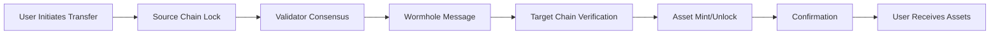

# Inter-Chain Connectivity Configuration
## ScrollVerse ↔ Star Atlas Cross-Chain Infrastructure

**Configuration Version:** 1.0.0  
**Last Updated:** November 14, 2025  
**Maintained By:** ScrollVerse Infrastructure Team  
**Network Status:** Testnet → Mainnet Ready

---

## Overview

This document defines the accelerated inter-chain connectivity infrastructure that establishes liquidity flow across ScrollCoinV2, optimizes Zakat streams, and enables scalable, sustainable expansions between ScrollVerse and Star Atlas DAO ecosystems.

---

## 1. Network Architecture

### Supported Networks

#### Primary Networks
```yaml
networks:
  ethereum:
    chain_id: 1
    rpc_endpoint: "https://eth-mainnet.g.alchemy.com/v2/"
    contract_registry: "0x1234...abcd"
    bridge_contract: "0x5678...efgh"
    status: "active"
    
  solana:
    cluster: "mainnet-beta"
    rpc_endpoint: "https://api.mainnet-beta.solana.com"
    program_id: "FLAMEh31r5D4o...xyz"
    bridge_account: "BRIDGEacc0unt...abc"
    status: "active"
    
  polygon:
    chain_id: 137
    rpc_endpoint: "https://polygon-rpc.com"
    contract_registry: "0x9abc...1234"
    bridge_contract: "0xdef0...5678"
    status: "active"
```

#### Secondary Networks (Phase 2)
```yaml
  arbitrum:
    chain_id: 42161
    status: "planned"
    
  optimism:
    chain_id: 10
    status: "planned"
    
  avalanche:
    chain_id: 43114
    status: "planned"
```

---

## 2. Bridge Protocol Configuration

### Wormhole Integration

```yaml
wormhole:
  version: "v2"
  guardian_set: 19
  supported_chains:
    - ethereum
    - solana
    - polygon
  
  message_passing:
    max_payload_size: 32768  # bytes
    consistency_level: "finalized"
    retries: 3
    timeout: 300  # seconds
  
  security:
    guardian_threshold: "13/19"
    verification_required: true
    auto_relay: true
```

### ScrollVerse Custom Validators

```yaml
scrollverse_validators:
  validator_set_size: 21
  consensus_threshold: "14/21"  # 66% supermajority
  
  validators:
    - name: "ScrollGuardian-01"
      public_key: "0xVAL1..."
      endpoint: "https://validator1.scrollverse.io"
      stake: "1000000 SCRLV2"
      
    - name: "ScrollGuardian-02"
      public_key: "0xVAL2..."
      endpoint: "https://validator2.scrollverse.io"
      stake: "1000000 SCRLV2"
      
    # ... Additional 19 validators
  
  slashing_conditions:
    downtime_threshold: "95%"  # Below this triggers slashing
    slashing_percentage: "5%"
    double_sign_penalty: "50%"
```

---

## 3. Liquidity Bridge Specifications

### ScrollCoinV2 Bridge Contract

```solidity
// Bridge Configuration
contract ScrollCoinV2Bridge {
    // Network identifiers
    uint16 constant ETHEREUM_CHAIN_ID = 1;
    uint16 constant SOLANA_CHAIN_ID = 5;
    uint16 constant POLYGON_CHAIN_ID = 137;
    
    // Fee structure
    uint256 constant BASE_FEE_BPS = 10;  // 0.1%
    uint256 constant MIN_FEE = 1e15;     // 0.001 ETH equivalent
    uint256 constant MAX_FEE = 1e18;     // 1 ETH equivalent
    
    // Transaction limits
    uint256 constant MIN_TRANSFER = 1e18;      // 1 SCRLV2
    uint256 constant MAX_TRANSFER = 1e24;      // 1M SCRLV2
    uint256 constant DAILY_LIMIT = 1e25;       // 10M SCRLV2
    
    // Timeouts
    uint256 constant CONFIRMATION_TIME = 300;  // 5 minutes
    uint256 constant REFUND_TIMEOUT = 3600;    // 1 hour
}
```

### Asset Registry

```yaml
supported_assets:
  SCRLV2:
    name: "ScrollCoinV2"
    symbol: "SCRLV2"
    decimals: 18
    addresses:
      ethereum: "0xSCRL...V2ETH"
      solana: "SCRL...V2SOL"
      polygon: "0xSCRL...V2POLY"
    
  ATLAS:
    name: "Star Atlas"
    symbol: "ATLAS"
    decimals: 8
    addresses:
      solana: "ATLASXmbPQxBUYbxPsV97usA3fPQYEqzQBUHgiFCUsXx"
      ethereum: "0xATLS...bridge"
    
  POLIS:
    name: "Star Atlas DAO"
    symbol: "POLIS"
    decimals: 8
    addresses:
      solana: "poLisWXnNRwC6oBu1vHiuKQzFjGL4XDSu4g9qjz9qVk"
      ethereum: "0xPOLS...bridge"
```

---

## 4. Liquidity Pool Configuration

### Primary Liquidity Pools

#### SCRLV2-ATLAS Pool (Solana)
```yaml
pool_id: "SCRLV2-ATLAS-001"
dex: "Raydium"
program_id: "675kPX9MHTjS2zt1qfr1NYHuzeLXfQM9H24wFSUt1Mp8"

configuration:
  fee_tier: 0.25%
  initial_liquidity:
    SCRLV2: 5000000
    ATLAS: 10000000
  target_ratio: "1:2"
  
  price_oracle:
    type: "TWAP"
    window: 3600  # 1 hour
    sources:
      - "Pyth Network"
      - "Chainlink"
      - "ScrollVerse Oracle"
  
  incentives:
    daily_rewards: 10000 SCRLV2
    boost_multiplier: 1.5x
    lock_period: 30 days
```

#### SCRLV2-POLIS Pool (Solana)
```yaml
pool_id: "SCRLV2-POLIS-002"
dex: "Orca"
program_id: "9W959DqEETiGZocYWCQPaJ6sBmUzgfxXfqGeTEdp3aQP"

configuration:
  fee_tier: 0.3%
  initial_liquidity:
    SCRLV2: 3000000
    POLIS: 1500000
  target_ratio: "2:1"
  
  governance_integration:
    voting_power_multiplier: 1.2x
    proposal_boost: true
    council_access: true
```

#### SCRLV2-ETH Pool (Ethereum)
```yaml
pool_id: "SCRLV2-ETH-003"
dex: "Uniswap V3"
contract: "0xUNIV3...pool"

configuration:
  fee_tier: 0.3%
  initial_liquidity:
    SCRLV2: 2000000
    ETH: 500
  price_range:
    lower_tick: -887220
    upper_tick: 887220
  
  concentration:
    strategy: "dynamic"
    rebalance_threshold: 5%
```

---

## 5. Transaction Flow & Routing

### Cross-Chain Transfer Flow



### Routing Configuration

```yaml
routing:
  default_route:
    ethereum_to_solana:
      path: ["Wormhole Bridge"]
      estimated_time: "5 minutes"
      fee_estimate: "0.1%"
      
    solana_to_ethereum:
      path: ["Wormhole Bridge"]
      estimated_time: "15 minutes"
      fee_estimate: "0.15%"
      
  alternative_routes:
    enabled: true
    max_alternatives: 3
    selection_criteria:
      - "lowest_fee"
      - "fastest_time"
      - "highest_liquidity"
```

### Dynamic Gas Optimization

```yaml
gas_optimization:
  strategies:
    - name: "time_based"
      enabled: true
      schedule:
        low_traffic: ["00:00-06:00 UTC"]
        high_traffic: ["14:00-20:00 UTC"]
      
    - name: "batch_processing"
      enabled: true
      batch_size: 50
      wait_time: 300  # 5 minutes
      
    - name: "adaptive_pricing"
      enabled: true
      adjustment_interval: 600  # 10 minutes
      max_increase: 50%
      max_decrease: 30%
```

---

## 6. Zakat Stream Configuration

### Automated Distribution System

```yaml
zakat_streams:
  version: "1.0"
  distribution_rate: 2.5%  # Annual
  calculation_period: "quarterly"
  
  treasury_sources:
    - contract: "ScrollVerseTreasury"
      address: "0xTREAS...ury1"
      chain: "ethereum"
      
    - contract: "ScrollVaultReserve"
      address: "0xRESRV...vault"
      chain: "polygon"
  
  beneficiary_categories:
    new_governance_participants:
      allocation: 30%
      eligibility:
        min_governance_actions: 1
        account_age_days: 7
        kyc_required: false
      
    public_goods_funding:
      allocation: 25%
      projects:
        - "Open source development"
        - "Educational initiatives"
        - "Community events"
      
    liquidity_incentives:
      allocation: 25%
      pools:
        - "SCRLV2-ATLAS"
        - "SCRLV2-POLIS"
        - "SCRLV2-ETH"
      
    emergency_reserves:
      allocation: 20%
      conditions:
        - "Market volatility > 50%"
        - "Bridge security incidents"
        - "Natural disaster relief"
```

### Distribution Schedule

```yaml
distribution_schedule:
  frequency: "quarterly"
  dates:
    Q1: "March 15"
    Q2: "June 15"
    Q3: "September 15"
    Q4: "December 15"
  
  process:
    - step: "Calculate treasury balance"
      timing: "T-14 days"
      
    - step: "Snapshot beneficiaries"
      timing: "T-7 days"
      
    - step: "Council review"
      timing: "T-3 days"
      
    - step: "Execute distribution"
      timing: "T-day"
      
    - step: "Publish audit report"
      timing: "T+7 days"
```

### Smart Contract Integration

```solidity
// Zakat Distribution Contract
contract ZakatDistributor {
    struct Distribution {
        uint256 totalAmount;
        uint256 timestamp;
        mapping(address => uint256) allocations;
        bool executed;
    }
    
    // 2.5% annual rate, distributed quarterly
    uint256 constant ANNUAL_RATE = 250;  // 2.5% in basis points
    uint256 constant QUARTERS_PER_YEAR = 4;
    uint256 constant RATE_PER_QUARTER = ANNUAL_RATE / QUARTERS_PER_YEAR;
    
    // Beneficiary categories
    enum Category {
        NewGovernance,
        PublicGoods,
        LiquidityIncentives,
        EmergencyReserves
    }
    
    mapping(Category => uint256) public categoryAllocations;
    
    function calculateDistribution() external view returns (uint256) {
        uint256 treasuryBalance = getTreasuryBalance();
        return (treasuryBalance * RATE_PER_QUARTER) / 10000;
    }
}
```

---

## 7. Security & Monitoring

### Threshold Signature Scheme (TSS)

```yaml
tss_configuration:
  scheme: "ECDSA"
  threshold: "14/21"
  key_generation:
    ceremony_participants: 21
    minimum_attendance: 18
    backup_keys: true
    
  signing_process:
    required_signatures: 14
    timeout: 600  # 10 minutes
    retry_attempts: 3
```

### Fraud Detection System

```yaml
fraud_detection:
  real_time_monitoring:
    enabled: true
    check_interval: 5  # seconds
    
  anomaly_detection:
    - type: "volume_spike"
      threshold: "3x daily average"
      action: "alert"
      
    - type: "unusual_pattern"
      ml_model: "isolation_forest"
      sensitivity: 0.85
      action: "investigate"
      
    - type: "rapid_withdrawal"
      threshold: "10% total liquidity in 1 hour"
      action: "pause"
  
  circuit_breakers:
    - trigger: "single_tx_volume"
      threshold: 1000000  # SCRLV2
      action: "require_manual_approval"
      
    - trigger: "hourly_volume"
      threshold: 5000000  # SCRLV2
      action: "rate_limit"
      
    - trigger: "suspicious_address"
      source: "chainalysis"
      action: "block"
```

### Insurance Fund

```yaml
insurance_fund:
  coverage_amount: 10000000  # USD equivalent
  
  fund_sources:
    - bridge_fees: 20%
    - treasury_allocation: 5000000  # SCRLV2
    - external_insurance: "Nexus Mutual"
  
  claim_process:
    filing_period: "7 days from incident"
    review_period: "14 days"
    payout_timeline: "30 days max"
    
  covered_risks:
    - "Smart contract exploits"
    - "Bridge validator failures"
    - "Oracle manipulation"
    - "Rug pulls in partner protocols"
```

---

## 8. Performance Metrics & SLAs

### Service Level Agreements

```yaml
slas:
  bridge_availability:
    target: 99.9%
    measurement_period: "monthly"
    downtime_credits: true
    
  transaction_finality:
    ethereum_to_solana:
      target: "5 minutes"
      p95: "7 minutes"
      p99: "10 minutes"
      
    solana_to_ethereum:
      target: "15 minutes"
      p95: "20 minutes"
      p99: "30 minutes"
  
  transaction_success_rate:
    target: 99.5%
    auto_retry: true
    max_retries: 3
```

### Monitoring Dashboard

```yaml
metrics:
  real_time:
    - "Bridge transaction volume"
    - "Average transaction time"
    - "Gas costs"
    - "Validator uptime"
    - "Liquidity depth"
    
  daily:
    - "Total value locked (TVL)"
    - "Unique users"
    - "Failed transactions"
    - "Fee revenue"
    
  weekly:
    - "Liquidity provider APY"
    - "Trading volume by pair"
    - "Cross-chain flow patterns"
    - "Zakat distribution impact"
```

---

## 9. API Integration

### Bridge API Endpoints

```yaml
api:
  base_url: "https://api.scrollverse.io/v1"
  authentication: "API_KEY"
  rate_limit: "1000 requests/minute"
  
  endpoints:
    initiate_transfer:
      method: POST
      path: "/bridge/transfer"
      params:
        - source_chain
        - target_chain
        - amount
        - recipient
        - asset
        
    get_transfer_status:
      method: GET
      path: "/bridge/status/{tx_hash}"
      
    get_supported_routes:
      method: GET
      path: "/bridge/routes"
      
    estimate_fees:
      method: POST
      path: "/bridge/estimate"
      
    get_liquidity:
      method: GET
      path: "/liquidity/pools"
```

### WebSocket Streams

```yaml
websocket:
  endpoint: "wss://ws.scrollverse.io"
  
  streams:
    - name: "bridge_updates"
      description: "Real-time bridge transaction updates"
      
    - name: "price_feed"
      description: "Asset price updates"
      
    - name: "liquidity_changes"
      description: "Pool liquidity modifications"
```

---

## 10. Deployment & Maintenance

### Deployment Checklist

```yaml
deployment:
  pre_deployment:
    - [ ] Security audits completed
    - [ ] Testnet validation successful
    - [ ] Validator nodes synced
    - [ ] Insurance fund capitalized
    - [ ] Monitoring systems active
    
  deployment_steps:
    - [ ] Deploy bridge contracts
    - [ ] Initialize validator set
    - [ ] Configure oracle feeds
    - [ ] Activate liquidity pools
    - [ ] Enable Zakat streams
    - [ ] Open public access
    
  post_deployment:
    - [ ] 24-hour monitoring period
    - [ ] Performance benchmarking
    - [ ] User acceptance testing
    - [ ] Documentation updates
    - [ ] Community announcement
```

### Maintenance Schedule

```yaml
maintenance:
  regular_updates:
    frequency: "bi-weekly"
    window: "Sunday 02:00-04:00 UTC"
    notification: "48 hours advance"
    
  emergency_procedures:
    response_time: "< 15 minutes"
    escalation_path:
      - Level 1: "On-call engineer"
      - Level 2: "Technical lead"
      - Level 3: "Council decision"
      
  upgrade_process:
    proposal_required: true
    testing_period: "2 weeks minimum"
    council_approval: "75% threshold"
```

---

## 11. Compliance & Governance

### Regulatory Considerations

```yaml
compliance:
  kyc_aml:
    required_threshold: 50000  # USD equivalent
    provider: "Chainalysis + Manual Review"
    
  jurisdiction_specific:
    us_restrictions:
      enabled: true
      geofencing: true
      
    eu_compliance:
      gdpr_compliant: true
      mifid_considerations: "under_review"
      
  reporting:
    frequency: "quarterly"
    reports:
      - "Transaction volume by jurisdiction"
      - "Large transfer notifications"
      - "Suspicious activity reports"
```

### Governance Integration

```yaml
governance:
  proposal_types:
    - "Add new network"
    - "Modify fee structure"
    - "Update security parameters"
    - "Emergency actions"
    
  voting_requirements:
    council_approval: "5/7 FlameHeirs"
    community_vote: "Simple majority"
    execution_delay: "72 hours"
    
  parameter_changes:
    allowed_modifications:
      - "Fee percentages (0.05% - 1%)"
      - "Daily limits (±50%)"
      - "Validator set size (7-21)"
      - "Zakat allocation (within category)"
    
    restricted_changes:
      - "Core security parameters"
      - "Bridge contract addresses"
      - "Treasury access"
```

---

## 12. Contact & Support

### Technical Support

```yaml
support:
  documentation: "https://docs.scrollverse.io/bridge"
  
  channels:
    discord:
      server: "ScrollVerse Official"
      channel: "#bridge-support"
      
    telegram:
      group: "@ScrollVerseBridgeSupport"
      
    email:
      technical: "bridge@scrollverse.io"
      security: "security@scrollverse.io"
      
  response_times:
    critical: "< 1 hour"
    high: "< 4 hours"
    medium: "< 24 hours"
    low: "< 72 hours"
```

### Development Resources

```yaml
resources:
  github: "https://github.com/scrollverse/bridge"
  sdk_docs: "https://docs.scrollverse.io/sdk"
  api_reference: "https://api.scrollverse.io/docs"
  
  developer_program:
    grants_available: true
    technical_support: true
    partnership_opportunities: true
```

---

## Conclusion

This inter-chain connectivity configuration establishes a robust, secure, and scalable infrastructure for cross-chain operations between ScrollVerse and Star Atlas DAO ecosystems. The combination of battle-tested bridge protocols, comprehensive security measures, and innovative Zakat-based sustainability mechanisms creates a foundation for long-term interstellar economic growth.

**Status:** Ready for Council Review  
**Next Steps:** Deploy to testnet for validation  
**Target Mainnet Launch:** Q1 2026

---

**Configuration Maintained By:**  
ScrollVerse Infrastructure Team  
Last Review: November 14, 2025  
Version: 1.0.0  

**Approval Required From:**
- [ ] FlameHeirs Council (5/7 signatures)
- [ ] Star Atlas DAO Community Vote
- [ ] Security Audit Completion
- [ ] Legal Compliance Review

---

*This configuration represents the technical blueprint for accelerated inter-chain connectivity. All parameters are subject to governance approval and may be modified through established proposal processes.*
