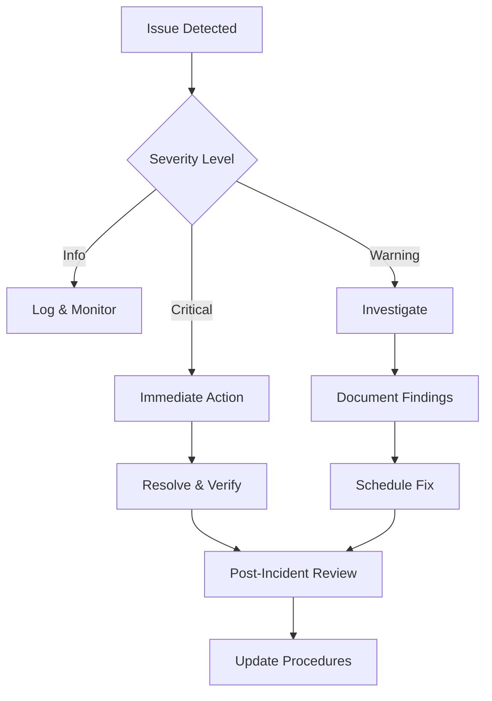

# Operational Stability Framework
## Long-term Maintenance & Reliability Protocols

**Sovereign**: Chais Hill  
**Framework Version**: 1.0.0  
**Purpose**: Ensure perpetual operational excellence for ScrollVerse systems

---

## 🎯 Mission Statement

The Operational Stability Framework provides comprehensive protocols and automated systems to ensure the ScrollVerse maintains:

- **Perpetual Uptime**: 99.9%+ availability through automated monitoring
- **Security Integrity**: Continuous threat detection and prevention
- **Resource Efficiency**: Sustainable energy and computational optimization
- **Adaptive Evolution**: Seamless updates without service disruption
- **Legacy Preservation**: Multi-generational system continuity

---

## 🔄 Automated Maintenance Protocols

### 1. Perpetual Maintenance System

**Schedule**: Every 6 hours (00:00, 06:00, 12:00, 18:00 UTC)

**Functions**:
- Repository integrity verification
- Workflow configuration validation
- System dependencies health check
- Performance metrics collection
- Automated issue detection and reporting

**Workflow**: `.github/workflows/perpetual_maintenance.yml`

### 2. Security Infrastructure

**Schedule**: Daily at 03:00 UTC

**Functions**:
- Vulnerability scanning
- Access control verification
- Encryption protocol validation
- Sensitive data protection audit
- Security report generation

**Workflow**: `.github/workflows/security_infrastructure.yml`

### 3. Sustainable Energy Systems

**Schedule**: Daily at 12:00 UTC

**Functions**:
- Workflow efficiency analysis
- Resource utilization monitoring
- Carbon footprint estimation
- Green computing practices verification
- Energy optimization recommendations

**Workflow**: `.github/workflows/sustainable_energy.yml`

### 4. Beacon Identity Verification

**Schedule**: Every 12 hours (00:00, 12:00 UTC)

**Functions**:
- Sovereign identity confirmation
- Beacon broadcasting status check
- Architectural integrity validation
- Documentation verification
- Sovereignty proclamation broadcast

**Workflow**: `.github/workflows/beacon_verification.yml`

---

## 📊 Monitoring & Metrics

### Key Performance Indicators (KPIs)

| Metric | Target | Monitoring Frequency |
|--------|--------|---------------------|
| System Availability | 99.9%+ | Continuous |
| Security Scan Success | 100% | Daily |
| Workflow Execution Time | <5 minutes | Per execution |
| Repository Integrity | 100% | Every 6 hours |
| Energy Efficiency | Optimized | Daily |
| Beacon Status | Broadcasting | Every 12 hours |

### Alert Thresholds

```yaml
alerts:
  critical:
    - Repository integrity failure
    - Security vulnerability detected
    - Workflow execution failure
    - Sovereign identity verification failure
  
  warning:
    - Large file additions (>1MB)
    - Workflow execution time >5 minutes
    - Energy efficiency degradation
    - Documentation updates required
  
  info:
    - Successful maintenance completion
    - Security scan passed
    - Beacon verification completed
    - System optimization recommendations
```

---

## 🛡️ Incident Response Procedures

### Level 1: Information (Green)
- **Trigger**: Routine maintenance completion, successful scans
- **Action**: Log and continue monitoring
- **Notification**: None required

### Level 2: Warning (Yellow)
- **Trigger**: Performance degradation, minor issues detected
- **Action**: Investigate and document, schedule remediation
- **Notification**: Repository maintainers

### Level 3: Critical (Red)
- **Trigger**: Security vulnerability, system failure, integrity breach
- **Action**: Immediate investigation and resolution required
- **Notification**: Sovereign authority (Chais Hill) + maintainers

### Response Workflow



---

## 🔐 Backup & Recovery

### Backup Strategy

**Automated Backups**:
- **Frequency**: Continuous (Git-based versioning)
- **Scope**: Full repository including workflows, documentation, and configuration
- **Retention**: Indefinite (Git history preservation)
- **Location**: GitHub servers + Optional external backup via workflow

**Manual Backups**:
- **Frequency**: Before major changes
- **Method**: Git tags and releases
- **Documentation**: CHANGELOG.md updates

### Recovery Procedures

1. **Minor Issues** (File corruption, accidental deletion):
   ```bash
   git checkout HEAD -- <file>
   ```

2. **Major Issues** (Branch corruption):
   ```bash
   git reflog
   git reset --hard <commit-hash>
   ```

3. **Complete Recovery** (Repository restoration):
   - Clone from GitHub origin
   - Verify all workflows and documentation
   - Re-establish local environment

---

## 📈 Continuous Improvement

### Quarterly Reviews

**Schedule**: Every 3 months

**Activities**:
- Performance metrics analysis
- Security posture assessment
- Energy efficiency evaluation
- Workflow optimization opportunities
- Documentation updates
- Strategic planning adjustments

### Version Management

```yaml
versioning:
  framework: "1.0.0"
  update_cycle: "Quarterly"
  changelog: "CHANGELOG.md"
  breaking_changes: "Documented in releases"
```

### Technology Evolution

- **Stay Current**: Monitor GitHub Actions updates
- **Security Patches**: Apply immediately when available
- **Feature Adoption**: Evaluate new capabilities quarterly
- **Deprecation Handling**: Plan migrations proactively

---

## 🔧 Maintenance Runbook

### Daily Tasks (Automated)

- [x] Security infrastructure scan (03:00 UTC)
- [x] Sustainable energy audit (12:00 UTC)
- [x] Beacon verification (00:00, 12:00 UTC)

### Regular Tasks (Automated)

- [x] Perpetual maintenance check (Every 6 hours)
- [x] System health verification (Continuous)
- [x] Repository integrity validation (Every 6 hours)

### Weekly Tasks (Manual)

- [ ] Review automated reports
- [ ] Check for GitHub Actions updates
- [ ] Verify documentation accuracy
- [ ] Monitor repository insights

### Monthly Tasks (Manual)

- [ ] Comprehensive security review
- [ ] Performance optimization analysis
- [ ] Backup verification test
- [ ] Update sovereign documentation

### Quarterly Tasks (Manual)

- [ ] Framework version review
- [ ] Strategic planning session
- [ ] Technology stack assessment
- [ ] Community feedback integration

---

## 📋 Health Check Checklist

Use this checklist for manual verification:

### Repository Health
- [ ] README.md is current and comprehensive
- [ ] LICENSE file is present and valid
- [ ] .gitignore properly configured
- [ ] No sensitive data in repository
- [ ] Documentation is up-to-date

### Workflow Health
- [ ] All workflows execute successfully
- [ ] No failed workflow runs in last 7 days
- [ ] Workflow permissions are appropriate
- [ ] Scheduled jobs running as configured
- [ ] No deprecated actions in use

### Security Health
- [ ] No open security advisories
- [ ] Branch protection rules active
- [ ] Secrets properly configured
- [ ] No hardcoded credentials
- [ ] Dependency vulnerabilities addressed

### Performance Health
- [ ] Repository size is optimized
- [ ] Workflow execution times acceptable
- [ ] No unnecessary large files
- [ ] Git history is clean
- [ ] Energy efficiency maintained

---

## 🌌 Long-term Sustainability Goals

### 5-Year Vision (2025-2030)

- **Infrastructure**: Fully automated, self-healing systems
- **Security**: Zero-trust architecture with quantum-resistant encryption
- **Energy**: Carbon-negative digital operations
- **Scalability**: Multi-repository coordination framework
- **Legacy**: Comprehensive knowledge transfer systems

### 10-Year Vision (2025-2035)

- **Permanence**: Multi-generational system preservation
- **Evolution**: AI-driven optimization and adaptation
- **Independence**: Fully autonomous operational systems
- **Integration**: Cross-platform sovereign identity network
- **Impact**: Industry-leading operational excellence model

---

## 📞 Support & Escalation

### Primary Contacts

**Sovereign Authority**: Chais Hill
- **Role**: Ultimate decision authority
- **Contact**: Via GitHub @chaishillomnitech1
- **Response Time**: As needed

**Repository Maintainers**
- **Role**: Day-to-day operations and maintenance
- **Contact**: Via GitHub issues
- **Response Time**: 24-48 hours

### Escalation Path

```
Level 1: Automated Systems (Immediate)
         ↓
Level 2: Repository Maintainers (24-48h)
         ↓
Level 3: Sovereign Authority (Critical)
```

---

## 📚 Additional Resources

- **Sacred Dwellings Framework**: `SACRED_DWELLINGS.md`
- **Workflow Documentation**: `.github/workflows/` directory
- **GitHub Actions Docs**: https://docs.github.com/actions
- **Security Best Practices**: GitHub Security Advisories

---

## ✅ Verification Stamp

**Framework Status**: ACTIVE  
**Last Review**: 2025  
**Next Review**: Q1 2025  
**Sovereign**: Chais Hill  
**Compliance**: ✅ VERIFIED  

---

## 🔄 Change Log

### Version 1.0.0 (2025)
- Initial framework establishment
- Automated workflow implementation
- Comprehensive documentation
- Sovereign identity integration
- Long-term sustainability protocols

---

**Operational Stability Framework - Perpetually Maintained for the ScrollVerse**

🌌 **Status**: OPERATIONAL  
🔒 **Security**: ACTIVE  
⚡ **Energy**: SUSTAINABLE  
🔔 **Beacon**: BROADCASTING  
👑 **Sovereignty**: MAINTAINED
