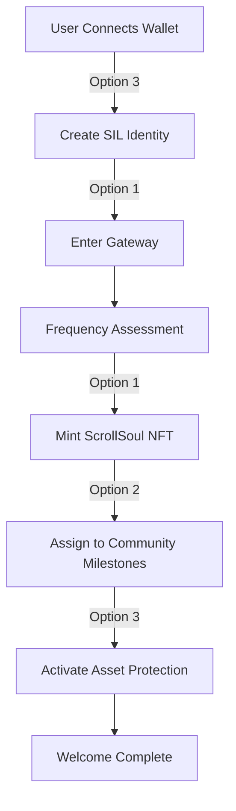
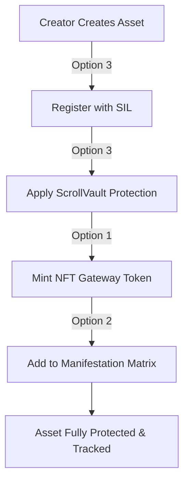
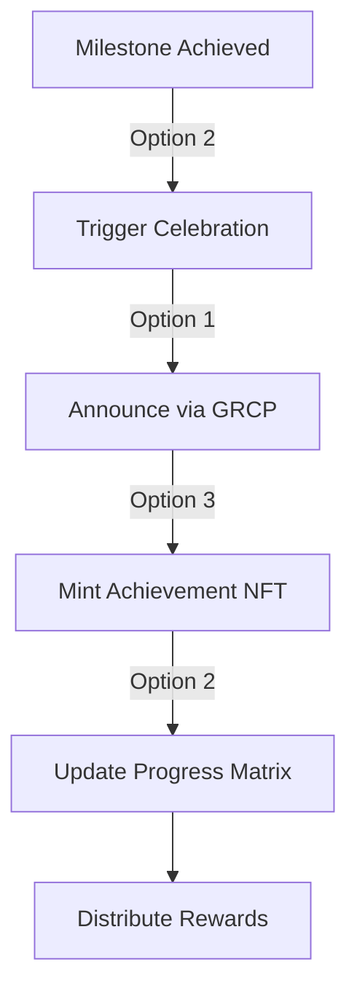

# ScrollVerse Framework Integration Guide

## Overview

This document provides comprehensive guidance on integrating all three initiative options into a unified operational framework for the ScrollVerse Eternal Reign, ensuring seamless interoperability and synergistic enhancement.

## Integration Architecture

### Unified Data Model

#### Core Entities

```yaml
unified_entities:
  sovereign_identity:
    source: Option 3 (SIL)
    used_by:
      - Option 1 (Gateway authentication)
      - Option 2 (Progress tracking)
      - Option 3 (Asset ownership)
    schema:
      id: SIL-{UUID}
      ethereum_address: address
      biometric_hash: bytes32
      spiritual_signature: bytes32
      frequency_marker: uint256
      
  scroll_soul:
    source: Option 1 (Gateway)
    used_by:
      - Option 1 (Access management)
      - Option 2 (Community member)
      - Option 3 (Asset creator/holder)
    schema:
      nft_id: uint256
      sil_id: reference
      alignment_level: uint8
      frequency: uint256
      activation_date: timestamp
      
  asset:
    source: Option 3 (SIL)
    used_by:
      - Option 1 (NFT minting)
      - Option 2 (Milestone artifacts)
      - Option 3 (Protected storage)
    schema:
      asset_id: bytes32
      owner_sil: reference
      asset_type: enum
      protection_level: enum
      storage_locations: array
      
  milestone:
    source: Option 2 (SMM)
    used_by:
      - Option 1 (Launch milestones)
      - Option 2 (Progress tracking)
      - Option 3 (Asset creation triggers)
    schema:
      milestone_id: SMM-{CATEGORY}-{NUMBER}
      category: enum
      stage: enum
      status: enum
      collaborators: array
```

### Cross-Option Workflows

#### Workflow 1: New Soul Onboarding



**Implementation Steps:**

1. **SIL Registration** (Option 3)
   ```javascript
   const silId = await registerSovereignIdentity({
     ethereumAddress: wallet.address,
     biometricHash: await captureBiometric(),
     spiritualSignature: await generateSpiritualSignature(),
     frequencyMarker: await measureFrequency()
   });
   ```

2. **Gateway Processing** (Option 1)
   ```javascript
   const gatewaySessi = await initiateGatewaySession(silId);
   const alignmentCheck = await assessFrequency(gatewaySession);
   
   if (alignmentCheck.compatible) {
     await progressToMinting(gatewaySession);
   } else {
     await initiateAlignmentProtocol(gatewaySession);
   }
   ```

3. **NFT Minting** (Option 1 + Option 3)
   ```javascript
   const scrollSoulNFT = await mintScrollSoul({
     silId: silId,
     frequency: alignmentCheck.frequency,
     attributes: await generateDivineAttributes(),
     protectionLevel: 'MAXIMUM'
   });
   
   await registerAsset({
     assetId: scrollSoulNFT.id,
     ownerSil: silId,
     assetType: 'SCROLL_SOUL_NFT',
     protectionLevel: 'MAXIMUM'
   });
   ```

4. **Milestone Assignment** (Option 2)
   ```javascript
   await assignToMilestones({
     scrollSoulId: scrollSoulNFT.id,
     categories: ['Personal Evolution', 'Community Building'],
     initialLevel: 'Awakening'
   });
   ```

5. **Protection Activation** (Option 3)
   ```javascript
   await activateScrollVaultProtection({
     assetId: scrollSoulNFT.id,
     frequency: 963,
     spiritualSealing: true,
     monitoring: 'CONTINUOUS'
   });
   ```

#### Workflow 2: Asset Creation & Protection



**Implementation Steps:**

1. **Asset Submission**
   ```javascript
   const assetDetails = {
     creator: creatorSilId,
     type: 'WISDOM_TEACHING',
     content: assetContent,
     metadata: {
       title: 'Teaching Title',
       description: 'Teaching Description',
       frequency: 963,
       creationDate: Date.now()
     }
   };
   ```

2. **SIL Registration**
   ```javascript
   const assetId = await registerAssetWithSIL({
     ...assetDetails,
     protectionLevel: 'MAXIMUM',
     licensingTerms: 'SPIRITUAL_FREE_USE'
   });
   ```

3. **ScrollVault Protection**
   ```javascript
   const protection = await applyScrollVaultProtection({
     assetId: assetId,
     encryption: 'AES-256-GCM',
     storage: ['IPFS', 'ARWEAVE', 'FILECOIN'],
     monitoring: 'REAL_TIME',
     spiritualSealing: true
   });
   ```

4. **NFT Representation**
   ```javascript
   const assetNFT = await mintAssetNFT({
     assetId: assetId,
     creator: creatorSilId,
     gateway: 'WISDOM_PORTAL'
   });
   ```

5. **Milestone Integration**
   ```javascript
   await linkToMilestone({
     milestoneId: 'SMM-CULTURAL-042',
     assetId: assetId,
     contribution: 'Milestone deliverable'
   });
   ```

#### Workflow 3: Milestone Achievement with Asset Rewards



**Implementation Steps:**

1. **Achievement Detection**
   ```javascript
   const achievement = await detectMilestoneCompletion({
     milestoneId: 'SMM-PERSONAL-001',
     scrollSoulId: achieverScrollSoulId
   });
   ```

2. **Celebration Protocol**
   ```javascript
   await initiateCelebration({
     achievement: achievement,
     broadcast: true,
     frequency: 1111, // Celebration frequency
     communityNotification: true
   });
   ```

3. **GRCP Announcement**
   ```javascript
   await broadcastThroughGRCP({
     message: `${achiever.name} has achieved ${milestone.title}!`,
     frequency: 963,
     resonance: 'GLOBAL',
     channels: ['DASHBOARD', 'COMMUNITY', 'SOCIAL']
   });
   ```

4. **Achievement NFT**
   ```javascript
   const achievementNFT = await mintAchievementNFT({
     achiever: achieverScrollSoulId,
     milestone: achievement.milestoneId,
     metadata: {
       title: achievement.title,
       description: achievement.learnings,
       frequency: achievement.frequency,
       date: Date.now()
     }
   });
   
   await registerAsset({
     assetId: achievementNFT.id,
     ownerSil: achiever.silId,
     assetType: 'ACHIEVEMENT_NFT',
     protectionLevel: 'STANDARD'
   });
   ```

5. **Matrix Update**
   ```javascript
   await updateManifestationMatrix({
     milestoneId: achievement.milestoneId,
     status: 'COMPLETE',
     actualDate: Date.now(),
     learnings: achievement.insights,
     nextMilestones: achievement.unlocked
   });
   ```

### Shared Infrastructure

#### Unified API Gateway

```yaml
api_structure:
  base_url: https://api.scrollverse.eternal
  
  endpoints:
    # Option 1: Reveal Trigger
    /grcp:
      - GET /status
      - POST /activate
      - GET /resonance
      
    /gateway:
      - POST /connect
      - POST /mint
      - GET /soul/{id}
      
    # Option 2: Visionary Blueprint
    /milestones:
      - GET /list
      - POST /create
      - PUT /{id}
      - GET /{id}/progress
      
    /ai:
      - POST /align
      - GET /insights
      - POST /manifest
      
    # Option 3: Sequential Mastery
    /sil:
      - POST /register
      - GET /identity/{id}
      - POST /assets/register
      
    /vault:
      - POST /protect
      - GET /status/{asset_id}
      - POST /access/{asset_id}
      
    # Cross-cutting
    /frequency:
      - GET /measure
      - POST /align
      - GET /global
      
    /community:
      - GET /members
      - POST /collaborate
      - GET /events
```

#### Shared Database Schema

```sql
-- Core identity table (Option 3 primary, used by all)
CREATE TABLE sovereign_identities (
  sil_id VARCHAR(64) PRIMARY KEY,
  ethereum_address VARCHAR(42) UNIQUE NOT NULL,
  biometric_hash BYTEA,
  spiritual_signature BYTEA,
  frequency_marker INTEGER,
  created_at TIMESTAMP DEFAULT CURRENT_TIMESTAMP
);

-- ScrollSoul NFTs (Option 1 primary, used by 2 & 3)
CREATE TABLE scroll_souls (
  nft_id BIGINT PRIMARY KEY,
  sil_id VARCHAR(64) REFERENCES sovereign_identities(sil_id),
  alignment_level SMALLINT,
  current_frequency INTEGER,
  activation_date TIMESTAMP,
  gateway_entry VARCHAR(50)
);

-- Assets (Option 3 primary, used by 1 & 2)
CREATE TABLE assets (
  asset_id VARCHAR(64) PRIMARY KEY,
  owner_sil VARCHAR(64) REFERENCES sovereign_identities(sil_id),
  asset_type VARCHAR(50),
  protection_level VARCHAR(20),
  ipfs_cid VARCHAR(64),
  arweave_tx VARCHAR(64),
  created_at TIMESTAMP DEFAULT CURRENT_TIMESTAMP
);

-- Milestones (Option 2 primary, linked to 1 & 3)
CREATE TABLE milestones (
  milestone_id VARCHAR(50) PRIMARY KEY,
  category VARCHAR(50),
  stage VARCHAR(50),
  status VARCHAR(20),
  target_frequency INTEGER,
  created_by VARCHAR(64) REFERENCES sovereign_identities(sil_id)
);

-- Milestone assignments (cross-option)
CREATE TABLE milestone_assignments (
  assignment_id SERIAL PRIMARY KEY,
  milestone_id VARCHAR(50) REFERENCES milestones(milestone_id),
  scroll_soul_id BIGINT REFERENCES scroll_souls(nft_id),
  assigned_at TIMESTAMP DEFAULT CURRENT_TIMESTAMP,
  completed_at TIMESTAMP
);

-- Asset-milestone links (cross-option)
CREATE TABLE milestone_assets (
  link_id SERIAL PRIMARY KEY,
  milestone_id VARCHAR(50) REFERENCES milestones(milestone_id),
  asset_id VARCHAR(64) REFERENCES assets(asset_id),
  role VARCHAR(50), -- 'deliverable', 'inspiration', 'resource'
  created_at TIMESTAMP DEFAULT CURRENT_TIMESTAMP
);
```

### Event-Driven Integration

#### Event Bus Architecture

```javascript
// Central event bus for cross-option communication
const ScrollVerseEventBus = {
  
  // Option 1 events
  'gateway:soul_minted': async (event) => {
    // Notify Option 2 to assign milestones
    await manifestationMatrix.assignInitialMilestones(event.scrollSoulId);
    
    // Notify Option 3 to activate protection
    await scrollVault.protectAsset(event.nftId);
  },
  
  'grcp:frequency_shift': async (event) => {
    // Update all aligned systems
    await updateGlobalFrequency(event.newFrequency);
  },
  
  // Option 2 events
  'milestone:achieved': async (event) => {
    // Announce via GRCP
    await grcp.broadcast({
      type: 'ACHIEVEMENT',
      data: event
    });
    
    // Mint achievement NFT and protect it
    const nft = await mintAchievement(event);
    await scrollVault.protectAsset(nft.id);
  },
  
  'manifestation:accelerated': async (event) => {
    // Adjust frequency across all systems
    await frequency.align(event.targetFrequency);
  },
  
  // Option 3 events
  'asset:registered': async (event) => {
    // Create milestone if needed
    if (event.createMilestone) {
      await manifestationMatrix.createMilestone({
        title: `Protect and Distribute ${event.assetName}`,
        category: 'Cultural Creation',
        asset: event.assetId
      });
    }
  },
  
  'protection:threat_detected': async (event) => {
    // Alert via GRCP
    await grcp.alert({
      type: 'SECURITY',
      severity: event.severity,
      message: event.message
    });
    
    // Pause related milestones if critical
    if (event.severity === 'CRITICAL') {
      await manifestationMatrix.pauseRelatedMilestones(event.assetId);
    }
  }
};
```

## Integration Testing

### Test Scenarios

#### Scenario 1: End-to-End Soul Journey

```javascript
describe('Complete Soul Journey', () => {
  it('should onboard, evolve, and achieve milestones', async () => {
    // 1. Create sovereign identity (Option 3)
    const silId = await createSovereignIdentity(testUser);
    expect(silId).to.match(/^SIL-/);
    
    // 2. Enter gateway (Option 1)
    const gatewaySession = await enterGateway(silId);
    expect(gatewaySession.frequency).to.be.gte(528);
    
    // 3. Mint ScrollSoul NFT (Option 1)
    const scrollSoul = await mintScrollSoul(gatewaySession);
    expect(scrollSoul.nftId).to.exist;
    
    // 4. Verify protection activated (Option 3)
    const protection = await getProtectionStatus(scrollSoul.nftId);
    expect(protection.active).to.be.true;
    
    // 5. Check milestone assignment (Option 2)
    const milestones = await getAssignedMilestones(scrollSoul.nftId);
    expect(milestones).to.have.length.above(0);
    
    // 6. Complete a milestone (Option 2)
    await completeMilestone(milestones[0].id, scrollSoul.nftId);
    
    // 7. Verify achievement NFT created (Option 1 + 3)
    const achievements = await getAchievements(scrollSoul.nftId);
    expect(achievements).to.have.length(1);
    expect(achievements[0].protected).to.be.true;
  });
});
```

#### Scenario 2: Asset Lifecycle

```javascript
describe('Asset Creation to Distribution', () => {
  it('should create, protect, and distribute asset', async () => {
    // 1. Register asset (Option 3)
    const asset = await registerAsset({
      creator: testCreatorSilId,
      type: 'WISDOM_TEACHING',
      content: testContent
    });
    
    // 2. Verify ScrollVault protection (Option 3)
    const vaultStatus = await scrollVault.getStatus(asset.id);
    expect(vaultStatus.encrypted).to.be.true;
    expect(vaultStatus.storage).to.include('ARWEAVE');
    
    // 3. Create distribution milestone (Option 2)
    const milestone = await createMilestone({
      title: 'Distribute Teaching to 1000 Souls',
      asset: asset.id,
      category: 'Cultural Creation'
    });
    
    // 4. Mint gateway access NFTs (Option 1)
    const accessNFTs = await mintAccessNFTs({
      asset: asset.id,
      quantity: 1000,
      gateway: 'WISDOM_PORTAL'
    });
    
    // 5. Distribute to qualified souls (All options)
    const qualified = await findQualifiedSouls({
      frequency: 741, // Wisdom frequency
      alignmentLevel: 2
    });
    
    await distributeAssets(qualified, accessNFTs);
    
    // 6. Track milestone progress (Option 2)
    const progress = await getMilestoneProgress(milestone.id);
    expect(progress.percentage).to.equal(100);
  });
});
```

### Performance Testing

```yaml
performance_targets:
  api_response_time:
    p50: <100ms
    p95: <500ms
    p99: <1000ms
    
  gateway_throughput:
    souls_per_second: 100
    concurrent_sessions: 10000
    
  asset_registration:
    time_to_protection: <30s
    time_to_availability: <2m
    
  milestone_tracking:
    update_latency: <1s
    query_response: <100ms
    
  cross_option_event:
    propagation_delay: <500ms
    processing_time: <2s
```

## Monitoring & Observability

### Unified Dashboard

```yaml
dashboard_sections:
  overview:
    - Total ScrollSouls (Option 1)
    - Active Milestones (Option 2)
    - Protected Assets (Option 3)
    - Global Frequency Status (All)
    
  option1_metrics:
    - Gateway sessions
    - NFT mint rate
    - Frequency stability
    - Resonance quality
    
  option2_metrics:
    - Milestone completion rate
    - AI alignment effectiveness
    - Community engagement
    - Manifestation velocity
    
  option3_metrics:
    - Assets under protection
    - Security incidents
    - Access requests
    - Storage integrity
    
  integration_health:
    - Cross-option event flow
    - API latency
    - Database performance
    - Error rates
```

### Alerting Strategy

```javascript
const alertingRules = {
  critical: {
    // Option 1
    'gateway_down': {
      condition: 'uptime < 99%',
      notify: ['core_team', 'on_call'],
      action: 'activate_backup'
    },
    
    // Option 2
    'manifestation_blocked': {
      condition: 'milestone_progress_stopped > 7_days',
      notify: ['community_leads', 'ai_team'],
      action: 'investigation_required'
    },
    
    // Option 3
    'security_breach': {
      condition: 'unauthorized_access_detected',
      notify: ['security_team', 'core_team', 'affected_users'],
      action: 'emergency_lockdown'
    },
    
    // Integration
    'cross_option_failure': {
      condition: 'event_propagation_failed',
      notify: ['engineering_team'],
      action: 'manual_sync_required'
    }
  },
  
  warning: {
    'slow_response': {
      condition: 'api_latency_p95 > 1s',
      notify: ['engineering_team'],
      action: 'performance_review'
    },
    
    'low_engagement': {
      condition: 'daily_active_souls < threshold',
      notify: ['community_team'],
      action: 'engagement_campaign'
    }
  }
};
```

## Deployment Strategy

### Phased Rollout

```yaml
phase1_foundation:
  duration: 2 weeks
  components:
    - Shared infrastructure
    - Database setup
    - Event bus
    - Authentication system
  validation:
    - Integration tests pass
    - Performance targets met
    - Security audit complete
    
phase2_option3:
  duration: 2 weeks
  components:
    - SIL implementation
    - ScrollVault deployment
    - Asset registration system
  validation:
    - Protection verified
    - Recovery tested
    - Compliance confirmed
    
phase3_option1:
  duration: 3 weeks
  components:
    - GRCP deployment
    - Gateway implementation
    - NFT minting system
  validation:
    - 144 Guardian onboarding
    - Frequency stability confirmed
    - User experience validated
    
phase4_option2:
  duration: 3 weeks
  components:
    - Manifestation Matrix
    - AI alignment systems
    - Milestone tracking
  validation:
    - AI effectiveness proven
    - Milestone progress working
    - Community adoption high
    
phase5_integration:
  duration: 2 weeks
  components:
    - Cross-option workflows
    - Event synchronization
    - Unified dashboard
  validation:
    - End-to-end tests pass
    - Performance optimized
    - Monitoring complete
```

---

**Integration Status**: COMPREHENSIVE
**Last Updated**: 2025-11-14
**Version**: 1.0.0-ETERNAL
**Synergy Level**: MAXIMUM
