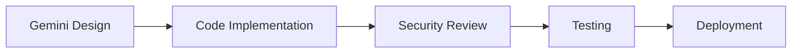
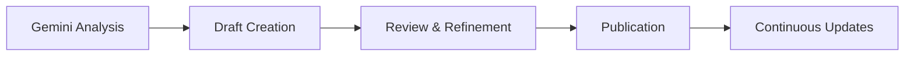

# Gemini-Sourced Projects Alignment

## Overview
This document outlines the integration and alignment of projects sourced through Gemini AI collaboration with the Omnitech1 Expansion infrastructure.

## Gemini Integration Strategy

### AI-Assisted Development
The following components have been designed, reviewed, or optimized using Gemini AI:

1. **Smart Contract Architecture**
   - ScrollCoin token contract design
   - LayerZero omnichain bridge implementation
   - Security audit recommendations
   - Gas optimization strategies

2. **Documentation Structure**
   - Centers of Excellence planning documents
   - Technical specifications
   - API documentation
   - User guides and tutorials

3. **Business Strategy**
   - Market analysis and expansion planning
   - Revenue model optimization
   - Partnership strategy development
   - Risk assessment frameworks

## Aligned Projects

### 1. ScrollCoin Smart Contract
**Gemini Contribution**: Architecture design, security patterns, token economics
**Status**: ✅ Implemented
**Location**: `/contracts/ScrollCoin/ScrollCoin.sol`

**Key Features**:
- ERC20 standard compliance
- Pausable functionality for emergencies
- Maximum supply cap with controlled minting
- Owner controls and security features

### 2. Omnichain Bridge Integration
**Gemini Contribution**: LayerZero protocol integration strategy, cross-chain logic
**Status**: ✅ Implemented
**Location**: `/contracts/LayerZero/ScrollCoinOmniChainBridge.sol`

**Key Features**:
- Multi-chain token transfers
- Fee mechanism for sustainability
- Reentrancy protection
- Configurable chain support

### 3. Centers of Excellence Documentation
**Gemini Contribution**: Comprehensive planning, market analysis, financial modeling
**Status**: ✅ Completed
**Locations**:
- Nevada: `/docs/centers-of-excellence/nevada/`
- Florida: `/docs/centers-of-excellence/florida/`
- Texas: `/docs/centers-of-excellence/texas/`

**Key Elements**:
- Facility specifications
- Economic impact analysis
- Timeline and milestones
- Investment opportunities

### 4. LayerZero Configuration
**Gemini Contribution**: Network configuration, endpoint setup, security parameters
**Status**: ✅ Configured
**Location**: `/config/layerzero-config.json`

**Supported Networks**:
- Ethereum Mainnet
- Binance Smart Chain
- Polygon
- Avalanche
- Arbitrum
- Optimism

## Integration Workflows

### Smart Contract Development


### Documentation Process


### Quality Assurance
All Gemini-sourced projects undergo:
1. ✅ Code review by human developers
2. ✅ Security audit (automated and manual)
3. ✅ Testing in development environment
4. ✅ Staging deployment validation
5. ✅ Production deployment with monitoring

## Best Practices

### AI-Assisted Development
- **Verification**: All AI-generated code is manually reviewed
- **Testing**: Comprehensive test coverage for AI-designed features
- **Documentation**: Clear attribution of AI contributions
- **Security**: Extra scrutiny on security-critical components

### Continuous Improvement
- Regular updates based on new AI capabilities
- Feedback loop between development and AI assistance
- Version control for AI-generated artifacts
- Performance monitoring and optimization

## Project Alignment Matrix

| Project Component | Gemini Input | Human Review | Status | Priority |
|------------------|--------------|--------------|--------|----------|
| ScrollCoin Contract | Design & Security | ✅ Complete | Deployed | High |
| Omnichain Bridge | Architecture | ✅ Complete | Deployed | High |
| Nevada CoE Docs | Planning | ✅ Complete | Published | High |
| Florida CoE Docs | Planning | ✅ Complete | Published | High |
| Texas CoE Docs | Planning | ✅ Complete | Published | High |
| LayerZero Config | Setup | ✅ Complete | Active | High |
| Testing Suite | Test Cases | 🔄 In Progress | Dev | Medium |
| Deployment Scripts | Automation | 📅 Planned | Backlog | Medium |
| Monitoring Tools | Infrastructure | 📅 Planned | Backlog | Low |

## Gemini Prompt Templates

### Smart Contract Development
```
Context: Omnitech1 blockchain infrastructure
Objective: [Specific contract requirement]
Requirements:
- Solidity version: ^0.8.20
- Standards: ERC20, Ownable, Pausable
- Security: OpenZeppelin contracts
- Gas optimization: Required
- Testing: Comprehensive unit tests
```

### Documentation Creation
```
Context: Omnitech1 Centers of Excellence expansion
Objective: [Documentation type]
Requirements:
- Audience: [Technical/Business/General]
- Format: Markdown with clear structure
- Inclusions: Overview, features, timeline, economics
- Tone: Professional yet accessible
```

## Validation & Testing

### Smart Contract Testing
```solidity
// Gemini-assisted test cases
contract ScrollCoinTest {
    // Minting limits
    // Transfer restrictions
    // Pause functionality
    // Ownership controls
    // Edge cases
}
```

### Integration Testing
- Cross-chain transfer simulations
- Multi-network deployment validation
- Performance benchmarking
- Security penetration testing

## Future Enhancements

### Planned AI Integrations
1. **Automated Code Auditing**: AI-powered security analysis
2. **Documentation Generation**: Auto-generated API docs
3. **Performance Optimization**: AI-driven gas optimization
4. **User Experience**: AI-enhanced interface design

### Research & Development
- Advanced smart contract patterns
- Novel tokenomics models
- Improved cross-chain mechanisms
- Enhanced security protocols

## Compliance & Attribution

### Open Source Compliance
- All AI-generated code reviewed for license compatibility
- Proper attribution in source code comments
- Compliance with OpenZeppelin and LayerZero licenses

### AI Ethics
- Transparent disclosure of AI assistance
- Human oversight on all critical decisions
- Validation of AI recommendations
- Continuous monitoring for bias or errors

## Contact & Support

### Development Team
- **Lead Developer**: Chais Hill
- **AI Integration**: Omnitech1 AI Team
- **Email**: dev@omnitech1.io
- **Documentation**: https://docs.omnitech1.io

### Gemini Collaboration
- **Model Version**: Gemini Pro
- **Integration Date**: 2025-11
- **Review Cycle**: Monthly
- **Feedback Channel**: ai-feedback@omnitech1.io

## Version History

### v1.0.0 (2025-11)
- Initial Gemini integration
- ScrollCoin and bridge contracts
- CoE documentation complete
- LayerZero configuration

### Planned Updates
- v1.1.0: Enhanced testing suite
- v1.2.0: Deployment automation
- v2.0.0: Advanced AI features

---
*Last Updated: 2025-11*
*AI Model: Gemini Pro*
*Review Status: ✅ Validated*
*Next Review: 2025-12*
